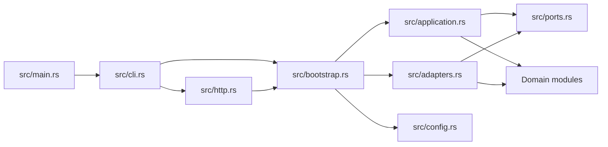
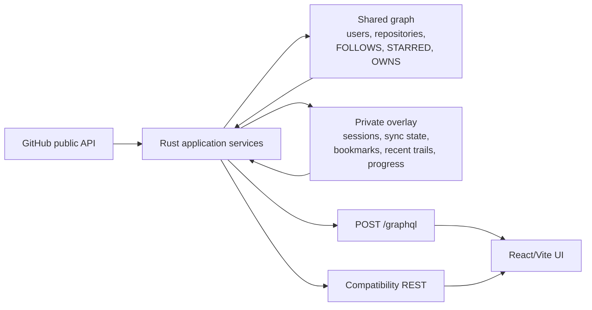

# Architecture

GitExplore is organized around product-facing repository contracts instead of one backend-shaped graph repository.

## Module structure

## Ownership boundary

Public GitHub identities, public repositories, and relationship facts are shared cache data. The authenticated app user owns connection credentials, the opaque browser session, bookmark state, categories, snapshots, sync state, recent-person routes, expedition progress, versioned onboarding lifecycle state, and discovery-warmup progress. Repository discovery joins the shared facts to only the current user's save overlay. Browser connections are canonicalized by stable GitHub user id, so reconnecting the same GitHub account preserves that private overlay. The stable account link remains when credentials are disconnected.

Shared graph identity is also stable-id first. Lowercase `login_key` and `full_name_key` properties provide case-insensitive alias lookup, while GitHub's numeric user/repository ids remain canonical. A rename moves the existing stable node to its new alias; reuse of an old alias by a different numeric id does not merge the two histories.

## Domain slices

- `identity`: GitHub connection state and opaque browser sessions
- `graph`: imports, freshness metadata, and sync state
- `discovery`: directional neighborhoods, private recent trails/progress, and explainable repository ranking
- `bookmarks`: private categories and saved user/repository targets
- `exploration`: legacy seed-based results and private snapshots
- `graphql`: typed neighborhood, expansion, and repository-save projection
- `shared`: errors and common helpers

## Code boundaries

- `src/ports.rs` defines the application-facing contracts.
- `src/application.rs` orchestrates use cases and knows only those contracts.
- `src/adapters.rs` holds file-backed, in-memory, GitHub API, and Neo4j implementations. Both graph adapters call the same Rust ranking function.
- `src/bootstrap.rs` is the composition root and chooses the active backend from config.
- `src/graphql.rs` owns the GraphQL schema and maps domain values to the browser contract.
- `src/http.rs` owns Axum routing, CORS, cookie resolution, OAuth redirects, and compatibility REST.
- `packages/api_client/` owns credentialed REST and GraphQL request construction.
- `apps/web/` owns React route behavior and product presentation. It consumes only the public root exports of `strawn` and `strawn-icons` for the shared design-system surface.

The authenticated application keeps three primary areas: Explore for graph traversal and discovery, Saved for bookmarks/collections/history, and Settings for synchronization, request budget, and account controls. Repository detail is a contextual deep link. Browser redirects preserve the former bookmarks, categories, snapshots, and sync entry points.

## Request flow

1. Browser OAuth creates opaque, one-time durable state with a 10-minute lifetime and binds it to an `HttpOnly`, `SameSite=Lax` browser nonce. Neo4j stores only a keyed state digest and an authenticated-encrypted nonce, so any service replica can complete the callback.
2. The callback validates and consumes both values. After token exchange, it probes the current `core` bucket and requires 1,001 requests before spending one on `GET /user`; it then canonicalizes the connection by stable GitHub user id, records the observed budget best-effort, and creates a 30-day server session represented by `gitexplore_session`.
3. `POST /graphql` resolves that session before schema execution; operations never accept a client-selected user id.
4. Browser requests target the current origin and include credentials. Vite proxies API paths during development; production service routes send the same paths to Rust under the shared browser origin.
5. `neighborhood` reads the shared graph plus the current user's private `saved` state.
6. `expandUser` synchronously fetches one public GitHub user's profile and imports at most 300 followers, 300 followed users, 300 starred repositories, and 300 owned repositories. Only public repositories enter the graph, and GraphQL reports coverage for each collection.
7. Concurrent expansion calls first deduplicate in-process and then acquire a fenced Neo4j lease keyed by `github-user:<lowercase-login>`; file mode keeps the in-process behavior.
8. The entity-refresh leader serializes GitHub REST work through the connected account's durable `GitHubIdentity` lease, probes the current `core` bucket, and admits the operation only when its maximum cost leaves the strict 1,000-request reserve.
9. `saveRepository` creates or reuses the current user's private bookmark.
10. After the profile request resolves, the four bounded follower, following, starred, and owned-repository collections are fetched concurrently. Neo4j imports the returned nodes and relationships with bounded `UNWIND` batches instead of one statement per item; repository contributors use the same batched write path.
11. After a profile resolves, `recordPersonVisit` validates the shared-graph route and updates only the current user's bounded `RECENTLY_VIEWED` route and monotonic deepest-trail value. `setRecentPersonVisible` hides or restores that route without touching bookmarks or public graph facts.
12. Neo4j replaces prior edges only for collections reported complete. Partial capped collections preserve prior edges and merge the returned entries; both paths run in the graph-import transaction. Bookmark writes are also transactional, and bookmark identity is protected by the owner/target uniqueness constraint.
13. `startDiscoveryWarmup` idempotently creates the current user's private warmup job. A background driver expands one frontier login per batch, reusing the public entity-refresh and private account-budget leases, until the frontier is exhausted or the reserve rejects the next bounded expansion.

See [Graph explorer and GraphQL](graph-explorer.md) for operation examples and the frontend trail workflow.

## Cache and refresh behavior

An authoritative user expansion records `last_fetched_at`, `stale_at`, `neighborhood_last_fetched_at`, and `neighborhood_stale_at`; the current TTL is six hours. Users merely encountered as neighbors do not inherit fresh-neighborhood metadata.

`neighborhood` is a cache read. `expandUser` is an explicit synchronous refresh. The React query cache keeps existing results visible while a refresh mutation is running. The in-process coordinator remains cancellation-safe, while Neo4j deployments add a five-minute, server-clock lease with opaque fencing tokens and one-minute renewal. Graph import validates and locks that token and records the durable outcome in the same transaction as the graph update. A killed replica is recoverable after lease expiry; stale owners cannot finish or clear a replacement lease. Cold contributor and commit-activity fetches use the same durable lease and renew ownership immediately before writing their shared cache.

Every entity-refresh leader then acquires a fenced account-budget lease. GitExplore probes the authenticated GitHub REST `core` bucket before the data request and conservatively reserves 13 requests for a graph expansion, one for contributors, or three for public events. Work is rejected when that maximum would cross the 1,000-request floor. Operator crawls may select a higher floor, and the durable coordinator enforces that requested value for each expansion. The current status and UTC reset are persisted; stale cache reads continue, while cold or explicit work receives a typed reset-aware error.

Discovery warmup stores its private breadth-first frontier and progress on the app user's constrained `SyncState` node. Each one-user batch is fenced by `discovery-warmup:<app-user-id>`, while its public expansion is independently deduplicated by `github-user:<login>`. Queued or running jobs are discovered through limited startup scans and a local scheduler runs at most four batches concurrently; a killed replica can therefore retry the current frontier entry after the warmup lease expires without creating an unbounded task set. Reserve-protected jobs remain stopped until an explicit start after their recorded GitHub reset requeues the same durable job. State advances only after the shared graph import succeeds. Fresh neighborhoods with complete coverage are read from the shared graph, retaining the current user's private saved projection, and spend no REST requests. The combined expanded-plus-pending set is capped at 10,000 users, deliberately far below the 190,000-node production import boundary; `frontierTruncated` reports dropped candidates and the job terminates after its retained frontier is exhausted.

Coverage records whether GitHub pagination finished for followers, following, starred repositories, and owned repositories. If a collection hits the 300-entry cap while another page exists, its coverage is incomplete. The returned portion is merged with the prior cache, existing edges for that collection are not deleted, and the neighborhood remains `STALE`. A complete collection is authoritative and replaces its prior edges. Neo4j performs all collection updates in one transaction, so any failure rolls the import back.

Legacy file data or Neo4j users that predate coverage fields are conservatively read as having all four collections incomplete and a stale neighborhood. A successful current refresh writes explicit coverage and can make the neighborhood fresh.

## Durable identity and local persistence

`IdentityRepository` owns pending OAuth state, connections, sessions, and per-GitHub-identity REST budget state. Pending state is opaque, single-use, browser-nonce-bound, valid for 10 minutes, and capped at 256 records with oldest-first eviction. Neo4j makes callback completion replica-independent. A single deleting query consumes the state before GitHub code exchange, so replay fails even if the callback is routed to another instance.

Server-side sessions expire after 30 days. Expired records are purged during creation and resolution, and the store is bounded to 4,096 active sessions by evicting the earliest-expiring record when necessary. Neo4j stores only an HMAC-SHA-256 digest of each cookie session id. `POST /auth/logout` deletes that durable record before expiring the browser cookie. Credential disconnect removes encrypted credential properties but retains the stable `github_user_id` to app-user link, allowing a later reconnect to recover the canonical private overlay.

`GITEXPLORE_IDENTITY_ENCRYPTION_KEY` is mandatory for every durable backend and is exactly 32 random bytes encoded as unpadded base64url. HKDF-SHA-256 derives independent encryption and digest keys. GitHub tokens and pending browser nonces use authenticated XChaCha20-Poly1305 ciphertext in `v1.<base64url-nonce>.<base64url-ciphertext-and-tag>` format with domain-separated associated data. A missing or malformed key prevents startup before a durable repository is constructed. A wrong key causes authenticated decryption to fail rather than returning corrupted credentials.

The file backend remains compatible for local use. On first open with the required key, a legacy plaintext `identity.json` is rewritten atomically with encrypted token and nonce fields. File-backed identity and graph updates serialize to a temporary file in the target directory, flush and fsync that file, then replace the destination. The explicit `identity migrate-to-neo4j --confirm` command performs this rewrite before copying identity records, marks a successful migration, and refuses a second run.

GitHub API, device-flow, and browser OAuth HTTP clients use a 10-second connection timeout and a 30-second request timeout for individual network calls.

## Compatibility surface

The GraphQL explorer is additive. Existing health, auth, sync, bookmark, category, seed exploration, and exploration-snapshot REST routes remain wired, and the CLI still supports auth, sync, bookmarks, categories, and legacy exploration. Private HTTP routes use the same cookie-derived app user as GraphQL.

## Current verification boundary

- Rust tests cover GraphQL authentication/schema behavior, private recent-route ordering/visibility/isolation and monotonic rank, OAuth state validation across service replicas, authenticated-encryption tamper rejection, legacy identity-file encryption, canonical reconnects and browser logout, direction preservation, coverage-aware partial imports, bounded public-only imports, ranking, private saved-state isolation, freshness, transactional bookmark behavior, cancellation-safe in-process expansion deduplication, shared cross-instance leases, stale-token fencing, warmup start deduplication/resume/reserve/isolation, and embedded schema parsing/checksums.
- API-client tests cover GraphQL request construction and recent-route direction normalization.
- React/Vite checks and tests cover click-trail helpers, recent-route restoration, direct visibility toggling, persistent-rank presentation, compatibility redirects, and UI types.
- An ignored live Neo4j integration test exercises batched graph/contributor imports plus a private recent-route round trip when a local instance is available. Browser OAuth and real GitHub API behavior still require valid GitHub credentials.
