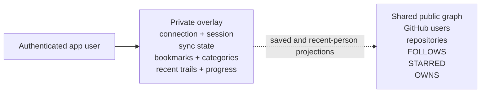
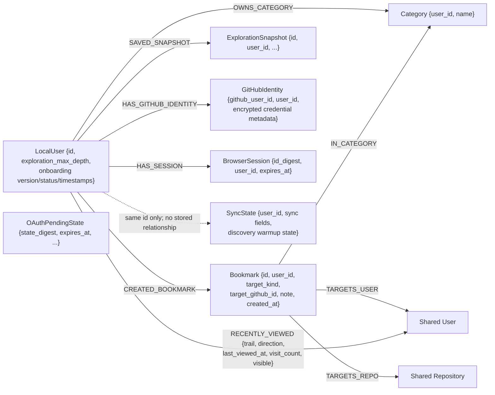

# Data Model

GitExplore uses one shared cache of public GitHub facts plus a private overlay for each authenticated app user. That boundary is the same whether the graph adapter is file-backed or Neo4j-backed.



There is no per-user copy of a GitHub user or repository. A repository's `saved` value is derived by joining that shared repository to only the requesting app user's bookmarks.

Browser connections are canonicalized by stable GitHub user id. Reconnecting the same GitHub account reuses its existing app-user id and private overlay. Connecting a different GitHub account does not overwrite the first account's bookmarks, categories, snapshots, recent trails, expedition progress, or sync state. Disconnecting credentials removes the connection record but deliberately retains the stable account link, so a future reconnect can recover the canonical app-user id.

`GitHubIdentity` also owns the last observed GitHub REST `core` status (`limit`, `used`, `remaining`, `reset_at`, and `observed_at`) plus an opaque, expiring rate-budget lease. The existing unique `github_user_id` constraint makes this state account-scoped and replica-safe without a new schema object. File identity storage persists the equivalent maps. The lease is fenced by token and renewed during long requests; only its current owner may renew or release it.

## Stable public identity and aliases

GitHub's numeric user and repository ids are canonical. Logins and repository full names are mutable aliases:

- aliases are looked up through lowercase normalized keys
- the same numeric id appearing under a new alias is a rename, so its graph relationships, cache metadata, coverage, and private bookmark targets follow it
- an old alias reused by a different numeric id is a distinct entity, not a continuation of the old history
- the displaced entity receives the reserved placeholder `__gitexplore-user-<github-id>` or `__gitexplore-repository-<github-id>` until GitHub reports its current alias

The file adapter performs this reconciliation while importing and rewrites alias-keyed edges, metadata, ownership references, and bookmarks. Neo4j merges nodes by `github_id`; `login_key` and `full_name_key` are unique normalized lookup properties, so alias changes do not replace stable nodes.

The Neo4j init migration backfills normalized keys on legacy nodes. Before adding the uniqueness constraints, it disambiguates case-colliding legacy aliases with the stable-id placeholders. It also backfills bookmark `target_kind` and `target_github_id` from existing target relationships before enforcing private owner/target uniqueness.

## File backend

The file backend stores identity separately from graph/application data:

```text
.gitexplore-data/
├── identity.json  # encrypted GitHub connections, OAuth state, and session mappings
└── graph.json     # shared graph plus private maps keyed by app user id
```

Pending browser OAuth state is persisted behind the same identity repository as completed connections and browser sessions. It is opaque, single-use, nonce-bound, valid for 10 minutes, and capped at 256 entries with oldest-first eviction. In the encrypted JSON representation, GitHub tokens and pending browser nonces use authenticated `v1` ciphertext; legacy plaintext fields are upgraded through atomic file replacement when the file is opened with the required key.

Each durable session record contains its app-user id and an expiry 30 days after creation. Expired sessions are purged when sessions are created or resolved. The identity store retains at most 4,096 active sessions, evicting the earliest-expiring record when it reaches that bound. Legacy string-only session mappings are upgraded to expiring records when `identity.json` loads. Browser logout removes the presented server-side mapping in addition to expiring the cookie.

The shared section contains:

- GitHub users keyed by login
- repositories keyed by full name
- directional `(from, to)` follow pairs
- `(login, repository)` star pairs
- `(login, repository)` ownership pairs
- user and repository cache metadata

The historical serialized field for ownership pairs is named `member_of`. New domain behavior treats those pairs as ownership; Neo4j writes use `OWNS`.

Private maps in `graph.json` are keyed by app user id:

- sync status
- categories
- bookmarks
- exploration snapshots

Both JSON stores use same-directory temporary-file replacement: GitExplore writes the complete serialization to a temporary file, flushes and fsyncs it, then replaces the target path. This prevents readers from observing a partially written JSON document. `identity.json` requires the same server-only encryption key as the Neo4j identity adapter and never writes a new plaintext GitHub token.

## Neo4j shared graph

### Nodes

`User` is merged by stable GitHub id and stores:

- identity: `github_id`, `login`, normalized `login_key`, `name`, `url`, `avatar_url`, `bio`
- public counts: `followers_count`, `following_count`, `public_repositories_count`
- entity freshness: `last_fetched_at`, `stale_at`, `last_refresh_error`
- neighborhood freshness: `neighborhood_last_fetched_at`, `neighborhood_stale_at`
- collection coverage: `followers_complete`, `following_complete`, `starred_repositories_complete`, `repositories_complete`

`Repository` is merged by stable GitHub id and stores:

- identity: `github_id`, `owner_login`, `name`, `full_name`, normalized `full_name_key`, `html_url`
- description and classification: `description`, `language`, `topics`
- discovery signals: `stargazer_count`, `fork_count`, `pushed_at`, `updated_at`
- state: `archived`, `is_fork`
- freshness: `last_fetched_at`, `stale_at`, `last_refresh_error`

### Relationships

```text
(follower:User)-[:FOLLOWS]->(followed:User)
(user:User)-[:STARRED]->(repository:Repository)
(owner:User)-[:OWNS]->(repository:Repository)
```

Follower direction is never collapsed into an undirected “connected” edge. Expanding `alice` imports GitHub followers as `(follower)-[:FOLLOWS]->(alice)` and following as `(alice)-[:FOLLOWS]->(followed)`.

Each imported followers, following, starred-repository, and owned-repository collection carries an explicit completeness flag. A complete collection is authoritative: its corresponding prior edges are removed and rebuilt. A collection that reached the 300-entry cap while GitHub still exposed another page is partial: its returned entries are merged while its prior edges are preserved. Neo4j applies every complete replacement and partial merge in one transaction, so a failed import rolls back instead of exposing a partially updated neighborhood. Writes use `OWNS`. Reads continue to include legacy `MEMBER_OF` edges so an existing database remains compatible while data is refreshed.

When capacity limits are configured, that transaction first write-locks a reserved singleton stored under the existing unique `RefreshLease.entity_key` constraint. It counts every node and relationship in the database, including the singleton and private/identity records, then admits a conservative upper bound that adds all distinct entities and directed relationships in the incoming payload. A rejected projection is explicitly rolled back before any graph mutation. Reusing the existing constrained label avoids changing the byte-immutable version-1 schema.

The shared graph does not use `LocalUser-[:OWNS_GRAPH]->User`. Public facts are shared and merged by their GitHub identities.

## Neo4j private overlay



Recent-person history is a private relationship from `LocalUser` to the canonical shared `User`, so GitHub login renames keep the saved destination attached to its stable numeric identity. The relationship stores the latest bounded trail (at most eight stable GitHub user ids with canonical login fallbacks), connection direction, server timestamp, visit count, and explicit visibility. Before a route can increase progress, every hop must resolve in the shared graph and every adjacent pair must have a `FOLLOWS` relationship in either direction. Recording a visit preserves `visible = false` after the user removes that person; the profile's Add action is the only operation that makes it visible again. Writes retain the 50 most recently viewed visible relationships plus 50 hidden opt-out tombstones, so an older explicit removal cannot silently reappear after pruning. `LocalUser.exploration_max_depth` only increases and is independent of removal, so earned Trailhead/Scout/Pathfinder/Cartographer progress survives restarts and shallower routes. The file adapter stores the equivalent per-user records and maximum in `graph.json`.

`LocalUser` also owns the versioned onboarding lifecycle. Neo4j stores `onboarding_version`, `onboarding_status`, `onboarding_started_at`, `onboarding_completed_at`, and `onboarding_dismissed_at`; file mode stores the equivalent record in a serde-defaulted per-user map. Step completion is derived from private visits and repository bookmarks within the active start window, not persisted as client-controlled booleans. Missing or older-version state means the current guide has not started.

`SyncState` is keyed directly by `user_id`; the current adapter does not add a relationship from `LocalUser`. It also owns that app user's serialized discovery-warmup job and a separately queryable status. The private job contains its id, connected-account seed, deduplicated expanded/frontier logins, current login, reserve observation, timestamps, and bounded error. Expanded and pending logins share a 10,000-user total bound, chosen to keep one private job well below the 190,000-node production import boundary. Once that bound is reached, additional candidates set `frontierTruncated` and are not retained, so exhausting the retained frontier still terminates the job. Neo4j updates this state only while the caller owns the fenced `discovery-warmup:<user_id>` `RefreshLease`; public users, repositories, and relationships discovered by the job still enter the shared graph.

`GitHubIdentity.github_user_id` and `.user_id` are each unique, preserving the same canonical private overlay when an account reconnects. Disconnect removes credential properties but retains this stable link. `OAuthPendingState` is unlinked and short-lived. Neo4j receives only authenticated ciphertext for GitHub tokens and nonces, plus keyed digests for OAuth state and browser-session identifiers; raw tokens and cookie values are never stored in graph properties.

Saving a repository creates:

```text
(current LocalUser)-[:CREATED_BOOKMARK]->(Bookmark)-[:TARGETS_REPO]->(shared Repository)
```

The discovery query checks that exact current-user path to calculate `saved`. Bookmarks for a different `LocalUser` do not affect the result.

Neo4j saves a bookmark and its category/target relationships in one transaction. The write uses `MERGE` with `(user_id, target_kind, target_github_id)`, and the composite `bookmark_owner_target_id` uniqueness constraint prevents duplicate saves for the same private owner and target. Categories and notes supplied with the first save are retained when that bookmark is reused. The file backend provides the same idempotent target semantics while holding its store lock.

## Freshness semantics

Authoritative expansion assigns a six-hour freshness window to the expanded user's entity and neighborhood, and to repositories returned by that expansion.

- `last_fetched_at` / `stale_at` describe the entity data.
- `neighborhood_last_fetched_at` / `neighborhood_stale_at` prove that the user's own relationship lists were fetched.
- A user that appears only in someone else's followers/following list has no neighborhood fetch timestamp and is treated as stale.
- If any collection has incomplete coverage, `neighborhood_stale_at` is set to the fetch time and the neighborhood remains `STALE`; preserving prior edges avoids treating a capped prefix as the complete GitHub graph.
- Persisted legacy data with no coverage fields is read as all four collections incomplete, not optimistically complete, and remains stale until a current refresh records explicit coverage.
- `last_refresh_error` is part of the persisted cache shape. Explicit `expandUser` remains synchronous; discovery warmup invokes that same expansion path from a bounded background batch.

## Schema constraints and indexes

`docker/neo4j/init/01-schema.cypher` is embedded into the Rust binary as migration version 1. `gitexplore schema apply` serializes migration runners with a Neo4j lease, verifies the stored SHA-256 checksum, applies pending idempotent statements, and records the version. `gitexplore schema check` verifies that checksum, exact constraint/index definitions, online index state, and normalized-key backfills. Neo4j application startup performs the same read-only check and fails closed when the schema is missing or mismatched.

Unique constraints:

- `local_user_id` on `LocalUser.id`
- `github_identity_github_user_id` on `GitHubIdentity.github_user_id`
- `github_identity_user_id` on `GitHubIdentity.user_id`
- `oauth_pending_state_digest` on `OAuthPendingState.state_digest`
- `browser_session_id_digest` on `BrowserSession.id_digest`
- `github_user_id` on `User.github_id`
- `github_user_login_key` on normalized `User.login_key`
- `github_repo_id` on `Repository.github_id`
- `github_repository_full_name_key` on normalized `Repository.full_name_key`
- `sync_state_user_id` on `SyncState.user_id`
- `bookmark_id` on `Bookmark.id`
- `bookmark_owner_target_id` on the composite `(Bookmark.user_id, Bookmark.target_kind, Bookmark.target_github_id)`
- `exploration_snapshot_id` on `ExplorationSnapshot.id`
- `category_owner_name` on the composite `(Category.user_id, Category.name)`

Indexes:

- `github_user_login` on `User.login`
- `github_repository_full_name` on `Repository.full_name`
- `github_repository_language` on `Repository.language`
- `github_repository_stargazer_count` on `Repository.stargazer_count`
- `github_user_neighborhood_stale_at` on `User.neighborhood_stale_at`
- `oauth_pending_state_expires_at` on `OAuthPendingState.expires_at`
- `browser_session_expires_at` on `BrowserSession.expires_at`

The Compose init service runs the binary's `schema apply` command after Neo4j becomes healthy and before the Rust service starts. Production runs `schema apply` followed by `schema check` as a release gate. Data backfills and named schema statements are rerunnable; an already-recorded migration whose embedded checksum changes is rejected rather than silently accepted. Applied migration sources are byte-immutable across platforms, including line endings; future schema changes must be added as a new ordered migration.

## Current scope

Implemented:

- shared public user/repository graph
- direction-preserving follower/following relationships
- starred and owned repository relationships
- public-only repository imports capped at 300 entries for each follower, following, starred, and owned collection
- per-collection coverage with stale, non-destructive merging for capped partial imports
- entity and neighborhood freshness metadata
- private bookmarks, categories, snapshots, sync state, and saved projections
- durable, encrypted GitHub connections plus replica-safe OAuth state and browser sessions in Neo4j
- durable per-identity GitHub REST status and fenced refresh-budget leases
- private, durable discovery-warmup jobs with fenced resumable progress and shared public imports
- private, bounded recent-person routes and monotonic expedition progress
- coverage-aware transactional Neo4j collection replacement/merging and constraint-backed, transactional bookmark saves
- compatibility reads for legacy `MEMBER_OF`

Future work:

- general-purpose queued refresh and rate-budget scheduling beyond discovery warmup
