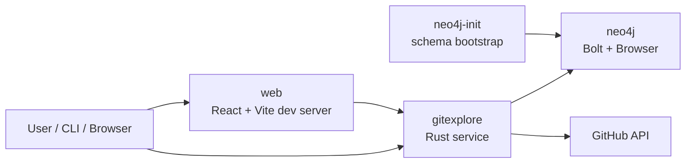

# Docker Runtime

The compose stack is the intended local Neo4j/OAuth integration path. It requires Docker Desktop (or another working Docker engine) and valid GitHub OAuth application credentials.

## Containers



## Boot flow

1. `neo4j` starts and exposes ports `7474` and `7687`.
2. `neo4j-init` waits for the database to become healthy and runs the same embedded `gitexplore schema apply` migration command used by production.
3. `gitexplore` starts with `GITEXPLORE_GRAPH_BACKEND=neo4j`, stores durable identity/session state in Neo4j, and serves HTTP on port `4000`.
4. `web` installs the frozen pnpm workspace and runs the Vite development server on port `3000`; Vite proxies API paths to the Rust service over the Compose network.

On an existing graph, migration version 1 backfills lowercase user/repository alias keys, disambiguates legacy case-colliding aliases with stable-id placeholders, migrates bookmark target identity from relationships, and then creates the normalized-key, refresh-lease, identity, and owner/target constraints. Migration runners serialize through a database lease, and application startup refuses to serve when the recorded checksum or schema definitions do not match the embedded migration.

The compose `web` service is a local development surface, not a production deployment configuration.

## Required configuration

Copy `.env.example` to `.env` and replace:

- `GITEXPLORE_GITHUB_CLIENT_ID`
- `GITEXPLORE_GITHUB_CLIENT_SECRET`
- `GITEXPLORE_IDENTITY_ENCRYPTION_KEY` (a unique 32-byte unpadded base64url secret)

For the default local ports, keep:

```dotenv
GITEXPLORE_GITHUB_REDIRECT_URI=http://localhost:4000/auth/oauth/callback
GITEXPLORE_GITHUB_SCOPES=read:user
GITEXPLORE_FRONTEND_ORIGIN=http://localhost:3000
```

The callback URI must also be registered on the GitHub OAuth application. The default OAuth scope is `read:user`, not `repo`; graph expansion uses public GitHub endpoints and imports only public repositories. Generate the identity key with the PowerShell recipe in the root README and keep it only in the ignored `.env` locally and the deployment secret manager in production. The Compose file includes a public development-only fallback so the local stack can boot with an empty value; that fallback is not a production secret. Do not commit a populated `.env`.

`GITEXPLORE_DEV_API_BASE_URL` configures only Vite's server-side development proxy. It defaults to `http://127.0.0.1:4000` outside Compose; the Compose `web` service sets it to `http://gitexplore:4000`. Browser code always targets the page origin, so the development proxy and production service routes preserve one credentialed origin without exposing an API host to the bundle.

`GITEXPLORE_DATA_DIR` selects the local file-backend state directory; Compose retains `/var/lib/gitexplore` so a legacy identity can be explicitly migrated. Identity and file-backed graph JSON updates are written through a same-directory temporary file that is flushed and fsynced before replacing the destination. GitHub tokens and pending browser nonces are authenticated-encrypted before a new JSON representation is persisted.

## Commands

Start the full stack:

```bash
docker compose up --build
```

Inspect logs:

```bash
docker compose logs -f gitexplore
docker compose logs -f neo4j
```

Open:

```text
http://localhost:3000/login
http://localhost:4000/health
http://localhost:7474
```

After browser OAuth, use `http://localhost:3000/app/explore` for the GraphQL explorer. Explore, Saved, and Settings are the three primary application areas; the former bookmarks, categories, snapshots, and sync URLs redirect into the appropriate area. OAuth start creates opaque, one-time server-side state with a 10-minute lifetime and binds it to an `HttpOnly`, `SameSite=Lax` nonce cookie scoped to `/auth/oauth`. Pending state is durable in Neo4j, capped at 256 entries with oldest-first eviction, and consumable by any service replica. The callback validates and consumes both values, clears the nonce, and sets `gitexplore_session`. Both cookies add `Secure` when the configured frontend origin uses HTTPS. Private REST and GraphQL requests rely on the session cookie and ignore client-selected user identifiers. Authenticated `GET /auth/status` exposes the canonical, server-derived `app_user_id` for trusted operator crawl dispatch; the unauthenticated value is `null`, and no browser endpoint accepts it as an identity selector.

The session cookie and its durable Neo4j record expire after 30 days. Neo4j stores a keyed digest rather than the cookie value. Expired records are purged during session creation/resolution, and the store is bounded to 4,096 active sessions. `POST /auth/logout` removes the current server mapping and returns an expired session cookie. Browser sign-out does not disconnect the GitHub credential. A credential disconnect removes encrypted credential properties but retains the stable account link so reconnecting the same GitHub account recovers its private overlay.

The authenticated shell also reads private `onboardingProgress`. Accounts without the current version see the embedded three-step first-value guide; lifecycle reads and writes are cookie-derived and accept no user id. The guide never starts discovery warmup automatically. Its optional mapping control invokes `startDiscoveryWarmup` only after explicit input and preserves the existing 1,000-request reserve.

### One-time identity migration

For a stack with an existing `/var/lib/gitexplore/identity.json`, stop the old `gitexplore` writer, start Neo4j and apply the current schema, then run the guarded migration with the same data volume and the production identity key:

```bash
docker compose stop gitexplore
docker compose up -d neo4j
docker compose run --rm neo4j-init
docker compose run --rm gitexplore gitexplore --format json identity migrate-to-neo4j --confirm
```

Apply or independently verify the configured Neo4j schema with:

```bash
docker compose run --rm gitexplore gitexplore --format json schema apply
docker compose run --rm gitexplore gitexplore --format json schema check
```

The command encrypts legacy plaintext secrets in the source file before any Neo4j write, copies stable account links, active credentials, unexpired pending states, and unexpired sessions, then records `neo4j_migrated_at`. It is idempotent while incomplete and refuses to run again after success. Do not run an old file-backed process against the migrated JSON file.

Run CLI commands inside the application image:

```bash
docker compose exec gitexplore gitexplore auth status --format json
docker compose exec gitexplore gitexplore sync status --format json
```

## Ports

- `4000`: GitExplore HTTP server
- `7474`: Neo4j Browser
- `7687`: Neo4j Bolt

## Expansion and outbound-request bounds

Each expansion fetches at most 300 entries independently for followers, following, starred repositories, and owned repositories. After the user profile resolves, those four collection streams run concurrently; the 13-request conservative admission cost is unchanged, but the cold critical path is no longer the sum of four pagination chains. GraphQL returns a completeness flag for every collection. If pagination still has another page at the cap, that collection is partial: existing cached edges are preserved, fetched entries are merged, and the neighborhood remains `STALE`. Only complete collections replace their previous edges. Neo4j applies all replacements and merges in one transaction using bounded `UNWIND` payloads instead of one query per returned node or relationship. Repository-contributor persistence likewise replaces as many as 100 individual contributor statements with one bounded batch.

Legacy file or Neo4j graph data with no coverage fields is treated as all four collections incomplete and stale until a current expansion records explicit coverage.

GitHub API and OAuth clients use a 10-second connection timeout and a 30-second request timeout for each HTTP call. Device authorization may span multiple polling calls until its separate GitHub-issued expiry.

### GitHub REST reserve

GitExplore keeps a strict reserve of 1,000 requests in the authenticated account's GitHub REST `core` bucket. GitHub normally gives an authenticated OAuth user 5,000 requests per hour, but the actual `limit`, `remaining`, and UTC `reset` returned for the account are authoritative; higher enterprise limits and other authentication methods exist. The budget is a resetting window, not a daily allowance or a lifetime total. See GitHub's [REST API rate-limit documentation](https://docs.github.com/en/rest/using-the-rest-api/rate-limits-for-the-rest-api).

OAuth completion preserves the same floor before it spends the one request needed to identify the authenticated account. After token exchange and before `GET /user`, GitExplore probes `GET /rate_limit` and requires at least 1,001 `core` requests remaining. Once the stable GitHub identity is known and saved, a best-effort observation persists its current status for later replicas.

After an entity refresh lease is won, GitExplore serializes crawl work for that stable `GitHubIdentity` and checks `GET /rate_limit` immediately before the GitHub data request. It admits work only when the reported remaining count can cover both the operation's conservative maximum and the 1,000-request reserve:

| Operation | Maximum admitted cost |
| --- | ---: |
| user graph synchronization or expansion | 13 requests |
| repository contributor refresh | 1 request |
| public user event refresh | 3 requests |

The observed `core` status and the fenced budget lease are durable in the identity store, so replicas using the same Neo4j database cannot start overlapping crawl work for one GitHub account. File mode persists the same status and lease shape for compatibility. `GET /rate_limit` does not consume the primary REST allowance, although GitHub documents that it can contribute to secondary limits, so status-only reads use a one-minute durable cache while every admitted refresh still performs a current preflight. A best-effort postflight records the resulting status.

The operator crawler may request a higher floor with `--request-reserve`; values below 1,000 are rejected. That selected floor is enforced by the same live, durable preflight immediately before every expansion, so a stale crawler-side status snapshot cannot admit work across the requested reserve.

The authenticated GraphQL discovery warmup applies the fixed 1,000 floor to a durable per-app-user breadth-first job. `startDiscoveryWarmup` is idempotent and seeds from the connected GitHub login; `discoveryWarmup` returns private progress without accepting a user id. The worker expands one public user per batch, yields for 25 milliseconds, then reacquires the private `discovery-warmup:<app-user-id>` lease for the next batch. Each public expansion separately uses the existing `github-user:<login>` lease and 13-request budget preflight. `RESERVE_PROTECTED` can therefore report an actual remainder from 1,000 through 1,012 when another worst-case expansion cannot be admitted without crossing the floor. It does not busy-loop: status reads and startup recovery leave it stopped, while an explicit start after its recorded reset atomically requeues the same job id and preserves the frontier.

The browser does not prefetch expansions or insight data on link hover. A person's optional public-event insight request is deferred until that section is within 240 pixels of the viewport (or explicitly requested when observation is unavailable), so opening a graph node prioritizes cache and trail work without immediately reserving three extra REST requests for below-the-fold content.

Warmup state is stored on `SyncState`, while imported users, repositories, and relationships remain shared cache facts. The durable state keeps the current entry in the frontier until its graph import succeeds. Startup and recovery read `QUEUED` or `RUNNING` jobs through limited scans; a local four-worker scheduler refills slots as one-user batches finish instead of spawning one task per stored job. After a crash, an uncommitted entry is safely retried once the prior fenced lease expires. Expanded and pending logins share a 10,000-user total bound, deliberately below the 190,000-node production import boundary. The API exposes `frontierTruncated` when additional candidates were dropped, and the retained frontier can still exhaust normally.

At the floor, cached graph reads, stale insight reads, and private saves remain available. A stale insight is returned while its rejected background refresh records an error. A cold fetch or explicit expansion fails with `RATE_BUDGET_RESERVED`, including `remaining`, `reserve`, `requestedCost`/`requested_cost`, and `resetAt`/`reset_at`; compatibility `POST /sync/run` returns HTTP 429. Retry after the returned reset time. The gate protects GitExplore's own refreshes, while GitHub's shared per-user budget can also be consumed by other OAuth apps or tokens.

Neo4j imports have a second, independent capacity boundary. Production config sets `GITEXPLORE_NEO4J_MAX_TOTAL_NODES=190000` and `GITEXPLORE_NEO4J_MAX_TOTAL_RELATIONSHIPS=380000`, leaving headroom below Aura Free's provider ceilings. The import transaction serializes graph-import capacity checks, counts every existing database node and relationship, and rejects a projected import before graph mutation when either limit would be crossed. The projection is intentionally conservative: it adds up to every distinct incoming user, repository, and directed relationship without subtracting data already stored or relationships an authoritative import may replace. A rejection reports the existing, up-to-incoming, projected, and configured maximum counts and explicitly rolls back the transaction. Identity, bookmark, session, and other ancillary creation paths consume the reserved provider headroom but are not globally serialized by this import mutex, so provider capacity still requires monitoring. The crawler's own discovery counters are progress controls; the transactional import boundary is authoritative for graph imports.

## HTTP surfaces

- `POST /graphql`: cookie-authenticated neighborhood, expansion, discovery-warmup, and save operations
- `/auth/*`: browser OAuth, connection status, and server-backed browser logout
- `/sync/*`, `/bookmarks`, `/categories`, `/explore*`: compatibility REST routes
- `GET /health`: unauthenticated health check

The configured frontend origin is the only credentialed CORS origin when it parses successfully. The typed browser client targets that same origin with `credentials: "include"`. Vite proxies API paths in local development; production routes them to the API service on the same origin.

## Verification boundary

Repository checks that do not require external services:

```powershell
cargo test
pnpm --filter @gitexplore/api-client test
pnpm --filter @gitexplore/web check
pnpm check
```

Those checks validate in-process behavior and types. The ignored `live_neo4j_refresh_lease_is_exclusive_and_fenced` test can additionally verify lease exclusivity against a configured database. They do not prove OAuth callback registration, GitHub credentials, API permissions, or live rate-limit behavior. Complete live verification still requires:

1. a running Docker engine
2. populated GitHub OAuth credentials
3. the callback URI registered at GitHub
4. a browser OAuth round trip
5. expansion of at least one user at `/app/explore/:login`

The migration apply/check commands and fenced refresh lease were exercised against the local Neo4j Compose database. The migration was also applied and checked successfully against Aura from the Linux production image. On Windows, use the containerized Aura schema workflow in [Production deployment](deployment.md#windows-operator-path-for-aura-schema-commands) so the command uses the image's public CA bundle without weakening TLS. The deployed browser OAuth round trip remains an operator verification step.
